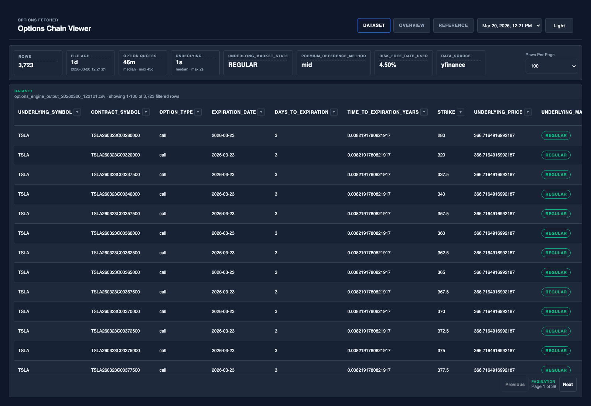

# opx

`opx` downloads near-term option chains, enriches them with pricing and screening metrics, writes a timestamped CSV, and serves the local Options Screener UI for inspection.

Its objective is to produce a cleaner, more executable options dataset that can be reviewed directly or fed into downstream tools that make decisions from the data, such as a trading system, portfolio workflow, or other automation layer. `opx` is the data and screening layer, not the decision engine itself.

## Quick Start

```
python -m venv .venv
source .venv/bin/activate
python -m pip install --upgrade pip
python -m pip install -e .
mkdir -p ~/.config/opx
cp config/example.toml ~/.config/opx/config.toml
opx-fetcher
opx-viewer
```

Then open `http://127.0.0.1:8000` in your browser.

If you want the viewer to launch the page automatically, run `opx-viewer --open`.

For one-off fetch runs, you can override the shared filter toggle from the CLI with `opx-fetcher --disable-filters` or `opx-fetcher --enable-filters` instead of editing `~/.config/opx/config.toml`.

For local development setup, including `.[dev]` extras and Playwright, use [docs/DEVELOPMENT.md](docs/DEVELOPMENT.md).

This repo can also enforce local quality checks before each commit through the tracked Git pre-commit hook described in [docs/DEVELOPMENT.md](docs/DEVELOPMENT.md).

Runtime configuration defaults live in [config/example.toml](config/example.toml). Copy it to `~/.config/opx/config.toml` and replace provider placeholders as needed.

The local viewer is organized around five primary tabs: `Dataset`, `Positions`, `Overview`, `Chain View`, and `Reference`.



## What You Get

- Fetches call and put chains for configured tickers
- Filters out zero-bid and wide-spread contracts before export
- Limits strikes to a configurable band around spot
- Computes Greeks, delta-safety, expected move, ROM-style metrics, configurable option scoring, and volatility context
- Writes a timestamped CSV plus an append-only run log
- Includes a local browser for exploring the output interactively, including dataset inspection, a positions browser for `data/positions.csv`, per-ticker overview cards, `Most Profitable`, `Moderate Risk`, `High Conviction Call`, and `High Conviction Put` highlights, plus chain visualizations with chart tooltips and click-through row details
- Produces normalized output that can feed other tools and systems which apply their own decision logic on top of the exported data

Generated files are standardized under:

- `output/` for exported CSV snapshots
- `logs/` for run logs
- `debug/` for optional raw provider payload dumps

## Documentation

- User guide: [docs/USER_GUIDE.md](docs/USER_GUIDE.md)
- Field reference: [docs/FIELD_REFERENCE.md](docs/FIELD_REFERENCE.md)
- Development guide: [docs/DEVELOPMENT.md](docs/DEVELOPMENT.md)
- Project spec: [docs/PROJECT_SPEC.md](docs/PROJECT_SPEC.md)
- System spec: [docs/SYSTEM_SPEC.md](docs/SYSTEM_SPEC.md)
- Design spec: [docs/DESIGN_SPEC.md](docs/DESIGN_SPEC.md)

## Important Notes

- Yahoo Finance can be delayed, stale, or sparse, especially near the regular market open. Always check freshness fields before relying on the output.
- Massive support depends on your plan. Lower tiers can leave you with trades but no `bid` or `ask`, and quote access may require Massive's highest-cost quote-enabled options plan.
- Market Data plan access affects recency. The Free Forever tier is 24 hours delayed for both stock and options data, so treat that provider as end-of-day-plus data unless your plan includes fresher access.

## Requirements

- Python 3.10+
- Python dependencies installed from `pyproject.toml`
- Internet access for provider data

Key dependencies:

- `yfinance` for the baseline Yahoo Finance provider
- `massive` for the official Massive / Polygon client library
- `marketdata-sdk-py` for the official Market Data client library
- `pandas`, `numpy`, and `scipy` for normalization and analytics
- `pytest` in the `dev` extra for the automated test suite
- `playwright` in the `dev` extra for browser-driven screenshot and UI checks
